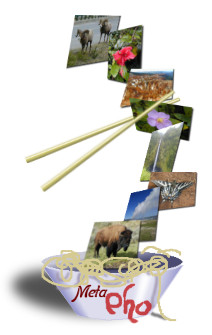
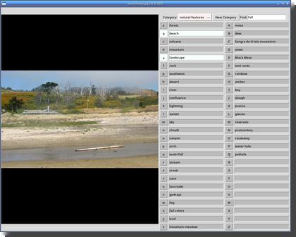
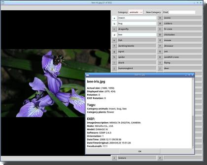

metapho
=======

An app for viewing, tagging and organizing large numbers of photos efficiently.

Metapho is intended as a lightweight, flexible way of organizing large
numbers of photos. It uses text files, not a proprietary database, so
you’re not locked down to one app or a proprietary database, and you can
view your tags databases at any time, or edit them in a text editor.

This arose out of my `Pho <http://shallowsky.com/software/pho/>`__ image
viewer (`Pho on GitHub <https://github.com/akkana/pho>`__), which was
starting to get unwieldy as I added ever more tagging features to what
was intended as just a fast, light image viewer.
Metapho will replace pho: the new Tk version of metapho includes a
pho image viewer script that’s roughly feature-compatible with the old pho.

Run metapho on a directory of images you’ve just uploaded:

::

   metapho *.jpg

and enter your tags. When you exit, it creates a file named *Tags*.

Metapho can be driven entirely from the keyboard: you should be able to
do everything you need without moving your hands to the mouse, though
you can use the mouse if you find that easier.

pho
===

Metapho also includes a basic image view called pho.
Pho is optimized for viewing a large number of images quickly
and making quick numeric tags, like keeping track of which images
you want to share right now.
It's also useful for giving photo-based presentations.
Like metapho, it's intended to be keyboard driven.

Command-line Scripts
====================

Installing also gets you three command-line scripts:

notags:
  Examine the current directory recursively and tell you about files and
  directories that still need to be tagged. Run it at the root of an
  image directory that might have untagged subdirectories.
  `Documentation. <https://metapho.readthedocs.io/en/latest/notags.html>`__

fotogr:
  Search for files with particular tags. For instance, ``fotogr flower``
  will print the names of all files you’ve tagged with “flower”.
  It has lots of options: you can search for combinations of tags,
  and limit the search to particular directories.
  See ``fotogr -h`` or the
  `man page <https://metapho.readthedocs.io/en/latest/fotogr.html>`__
  for details.

photoshare:
  Manage files tagged with “share” or “wallpaper”. See ``photoshare -h``
  or the `man page <https://metapho.readthedocs.io/en/latest/photoshare.html>`__
  for more info.

A Note about GTK versus Tk
==========================

In the past, metapho was built on GTK (most recently GTK3), though it
never needed Gnome or any other desktop services. But after trying to
port it to GTK4, I concluded it would be easier to rewrite it in Tk, plus
it would be easier for people on non-Linux OSes. So metapho 2.0 will be
Tk based, without a GTK dependency.

I’ve been using the Tk versions of pho and tkmetapho since January 2025
and they've been working well. I have now made them the default;
the GTK versions are now obsolete. Metapho now also includes a Tk-based
image viewer called pho, replacing my old GTK-based
`pho <https://shallowsky.com/software/pho/>`__ image viewer.

Currently what metapho installs is:

-  metapho: TkInter-based metapho tagging app
-  tkmetapho: TkInter-based metapho tagging app
-  tkpho: TkInter-based pho image viewer
-  gmetapho: GTK3-based metapho tagging app
-  gmpiv: GTK MetaPho image viewer

plus several helper scripts.

When 2.0 is released, metapho and pho will be the TkInter versions,
though gmetapho will still work if you have GTK3 libraries installed.

On Debian, you’ll need packages: python3-tk python3-pil
python3-pil.imagetk

How to Install
==============

`Metapho is available on
PyPi <https://pypi.python.org/pypi/metapho/>`__, so you can install it
as ``pip install metapho`` (though of course the PyPI version won’t
always have the very latest features and bug fixes).

To install from the source directory, use ``pip install .``

Documentation
=============

The `Metapho Documentation on ReadTheDocs
<https://metapho.readthedocs.io/en/latest/>`__
has more information on both the app and the API of the classes inside it.
It was out of date for a while because of a tools issue,
but it's updated now.

There are also man pages that you can install on Linux/Unix. Unfortunately,
Python pip doesn't have a way to install man pages; but you can build them
with

::

    make man

in the `docs` directory, which produces files in `build/man`
that you can install to anywhere you keep section 1 man pages.
Or just read them fvia the links above.
